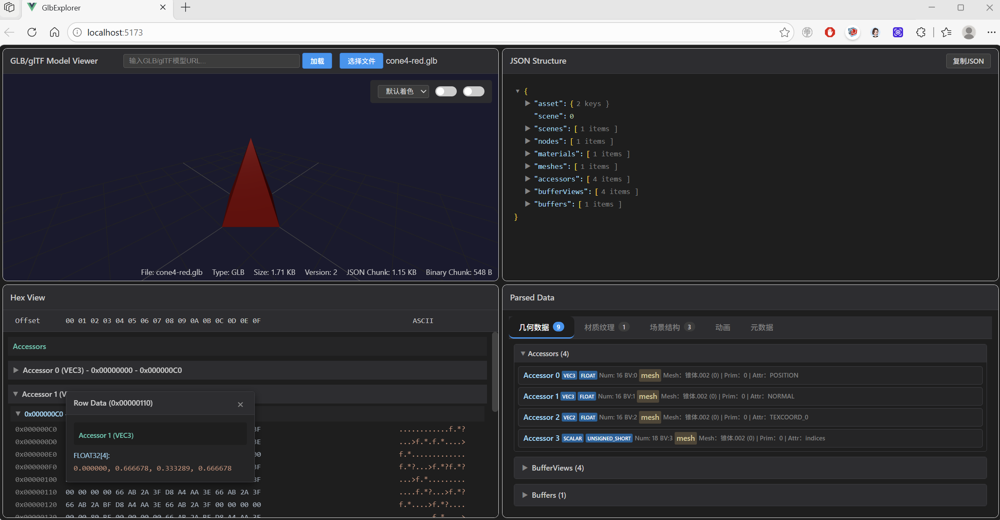

# Glb Explorer

Glb Explorer 是一款基于 Vue 3 和 Three.js 开发的 GLB 模型二进制数据查看与分析工具。它专为 GLB/glTF 模型的深度检查与数据分析而设计，是开发者理解和调试 3D 模型结构的得力助手。



## 功能特性

### 核心功能

- **3D 模型预览**：加载并渲染 GLB/glTF 格式的三维模型
- **JSON 结构解析**：以树形结构展示 GLB/glTF 的 JSON 头部数据结构
- **十六进制数据查看**：支持查看模型的二进制原始数据
- **解析数据视图**：将二进制数据解析为可读的矢量数据格式

### 模型解析能力

- 几何信息（Mesh、Primitive）
- 材质信息（Material）
- 纹理信息（Texture、Image）
- 动画信息（Animation）
- 访问器数据（Accessor）
- **EXT_structural_metadata 扩展支持**：解析模型中的结构化元数据

### 交互功能

- **拖拽加载**：支持将本地 .glb/.gltf 文件直接拖入场景
- **URL 加载**：支持输入模型 URL 进行加载
- **文件上传**：传统的文件选择器上传方式
- **OrbitControls 交互**：支持鼠标旋转、缩放、平移查看模型
- **Web Worker 异步解析**：使用 Web Worker 异步解析 GLB 数据，避免主线程阻塞

### 渲染控制

- **着色模式切换**：默认着色、法向着色、UV 着色
- **线框模式**：开启三角网拓扑结构显示
- **双面渲染开关**：控制模型的背面剔除

### 数据对比

- 十六进制视图与解析后数据的同步高亮显示
- JSON 树节点与对应二进制区域的双向联动

## 技术栈

- **Vue 3**：前端框架
- **Three.js**：3D 渲染引擎
- **Vite**：构建工具

## 快速开始

### 安装依赖

```bash
npm install
```

### 启动开发服务器

```bash
npm run dev
```

### 构建生产版本

```bash
npm run build
```

## 使用说明

### 加载模型

1. **拖拽方式**：直接将 .glb 或 .gltf 文件拖到页面上
2. **URL 方式**：在顶部输入框输入模型 URL，按回车或点击"加载"按钮
3. **文件上传**：点击"选择文件"按钮，选择本地 .glb/.gltf 文件

### 视图说明

- **左上**：3D 预览区域及模型信息
- **右上**：JSON 结构树
- **左下**：十六进制数据视图
- **右下**：解析后的数据视图

### 操作提示

- 鼠标左键拖拽旋转视图
- 滚轮缩放
- 右键拖拽平移
- 双击 JSON 树节点可定位到对应的二进制数据

## 项目结构

src/
├── App.vue                 # 主应用组件
├── main.js                 # 应用入口
├── components/
│   ├── JsonTree.vue         # JSON 结构树
│   ├── HexViewer.vue        # 十六进制查看器
│   ├── HexGroup.vue         # 十六进制行分组
│   ├── HexRow.vue           # 十六进制单行
│   ├── JsonNode.vue         # JSON 树节点
│   ├── ParsedDataView.vue   # 解析数据视图
│   ├── TexturesView.vue     # 纹理视图
│   ├── ImagePreview.vue      # 图片预览
│   ├── AccessorsView.vue    # 访问器视图
│   └── StructuralMetadata/   # 结构化元数据相关组件
├── utils/
│   ├── gltfLoader.js        # glTF 加载工具
│   ├── glbParserWorker.js   # Web Worker 解析器
│   ├── shadingUtils.js      # 着色工具
│   └── hexViewerUtils.js    # 十六进制工具
└── style.css                # 全局样式

## License

Apache License 2.0